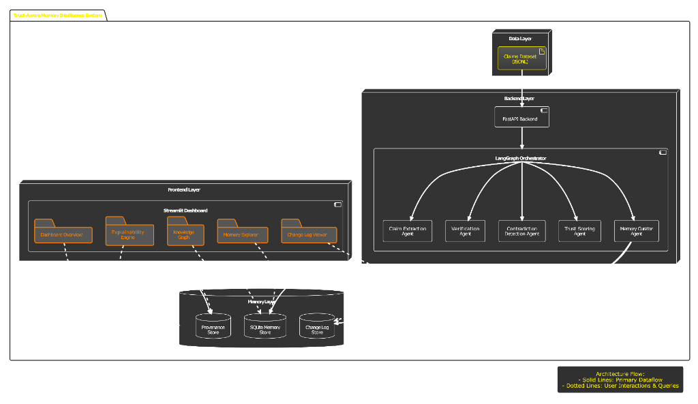
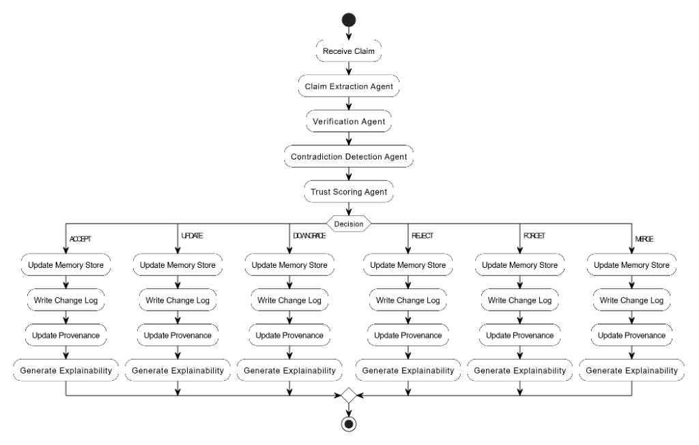
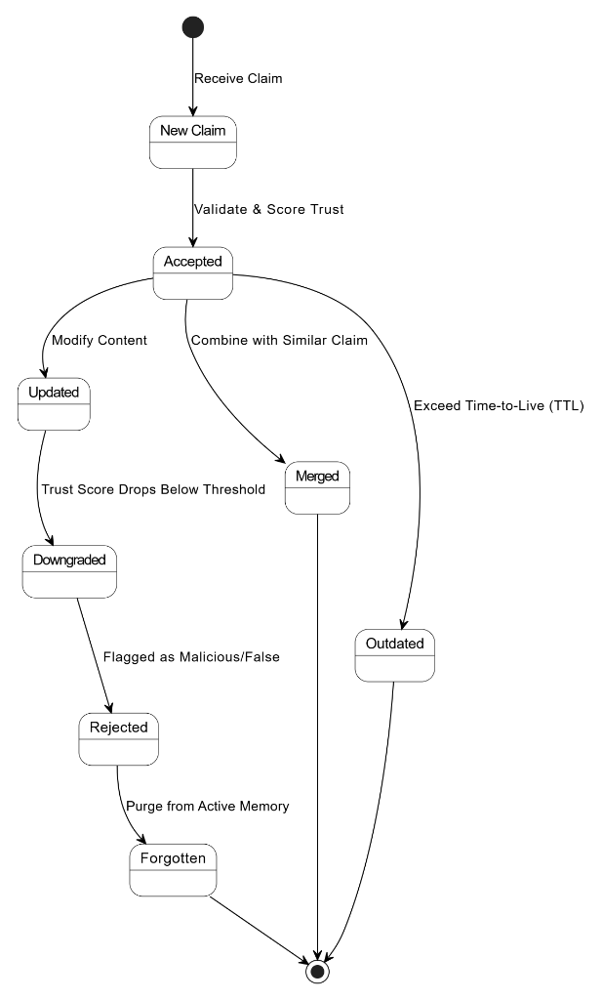

# Submission Documentation

This folder contains the core architectural diagrams and explanations for the **Trust-Aware Memory Intelligence System**. These diagrams illustrate the system's structural layout, the step-by-step processing pipeline, and the lifecycle of a memory.

---

## 1. System Architecture

### Explanation
The system is divided into four primary layers, designed for modularity, real-time feedback, and deterministic auditing:

*   **Data Layer:** Serves as the origin of information, passing a JSONL claims dataset (or live incoming claims) to the backend.
*   **Backend Layer:** The core intelligence engine. **FastAPI** provides the RESTful entry points. The **LangGraph Orchestrator** manages the multi-agent workflow, dynamically passing state between five specialized agents:
    *   *Claim Extraction Agent:* Parses unstructured text into structured SPO (Subject-Predicate-Object) triples.
    *   *Verification Agent:* Assesses logical coherence and verifiability.
    *   *Contradiction Detection Agent:* Identifies conflicts or duplicates against existing memory.
    *   *Trust Scoring Agent:* Calculates the final mathematical trust weight.
    *   *Memory Curator Agent:* Makes the final CRUD decision on the knowledge graph.
*   **Memory Layer:** Powered by SQLite (or PostgreSQL in production), consisting of three stores:
    *   *Memory Store:* The current state of "truth."
    *   *Change Log Store:* An immutable ledger of every decision made.
    *   *Provenance Store:* The origin and reliability of every source supporting a memory.
*   **Frontend Layer:** A comprehensive **Streamlit Dashboard** that visualizes the data via interactive Plotly and PyVis network graphs, allowing users to explore the knowledge graph, view the evolution timeline, and read the explainability engine's reasoning.

---

## 2. Processing Pipeline

### Explanation
This diagram outlines the sequential flow of a single claim through the system:

1.  **Ingestion:** The system receives a raw claim.
2.  **Agent Sequence:** The claim sequentially passes through the Extraction, Verification, Contradiction Detection, and Trust Scoring agents.
3.  **The Decision Node:** The Curator Agent evaluates the context and executes one of six distinct actions: `ACCEPT`, `UPDATE`, `DOWNGRADE`, `REJECT`, `FORGET`, or `MERGE`.
4.  **Action Execution:** Regardless of the decision made, the system uniformly executes four critical final steps:
    *   *Update Memory Store:* Modifies the current truth if necessary.
    *   *Write Change Log:* Permanently records the action taken.
    *   *Update Provenance:* Attaches the source to the memory.
    *   *Generate Explainability:* The Explainability Engine generates a natural language justification for the action, which is displayed to the user.

---

## 3. Memory State Transitions

### Explanation
This state diagram illustrates the lifecycle and possible states of a memory within the system:

*   **New Claim:** The initial state of incoming data.
*   **Accepted:** If validated and scored highly, the claim becomes an active memory.
*   **Updated / Merged:** An existing `Accepted` memory can be `Updated` (content modified by a more reliable source) or `Merged` (corroborated by another source, boosting confidence).
*   **Downgraded:** If a conflicting claim introduces uncertainty, the existing memory's trust score drops, placing it in a `Downgraded` state.
*   **Rejected / Forgotten:** Claims flagged as false are `Rejected`. If an active memory's score drops below a critical threshold due to reliable contradiction, it is purged from active memory and marked as `Forgotten`.
*   **Outdated:** Memories that exceed their Time-To-Live (TTL) automatically transition to an `Outdated` state, ensuring the system doesn't hold onto stale, unrefreshed facts indefinitely.
